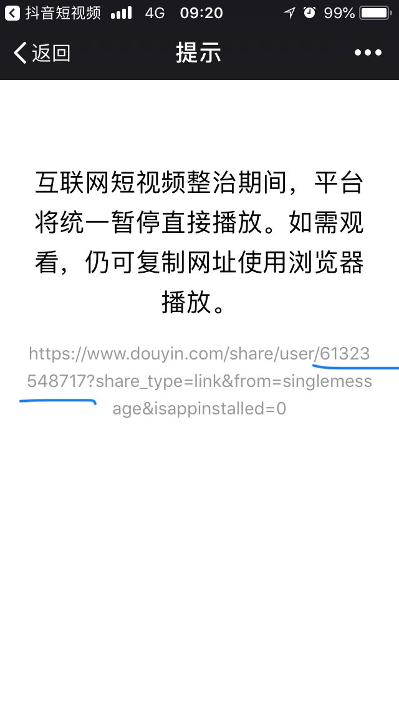

# 抖音下载小助手
 - 输入抖音id,下载用户发表/喜欢的视频
 - 所需环境:Python 3.5+ Chrome 67+
 - 所需依赖:
     - requests 2.19.1
     - selenium 3.12.0

# 更新 2018-07-14
- 新增数据库功能,能自动记录上一次下载的位置,接着下载
- 修复编码问题
- 获取喜欢视频请求方式修复
- 新增对抖音用户的收藏,详情见favorite.md


## Setup
``` 
    # 安装Python3.5;安装Chrome67
    # Python3.5安装包:https://www.python.org/downloads/windows/
    # Chrome67(需翻墙):https://www.google.com/chrome/index.html

    # 切换到项目所在目录
    cd ../你的目录/douyin-downloader

    # 安装依赖
    pip install -r requirements.txt

    # 配置抖音id(两种方式):1:修改config.txt下面的user_id; 2:命令行敲入id.
    # 注:命令行敲入id会覆盖掉配置文件里的id
    
    # 第一种方式:修改config.txt后执行
    python Douyin.py
    
    # 第二种方式:比如1234是一个抖音id
    python Douyin.py 1234

    #Enjoy it :)

```

## 获取抖音id的方法
进入用户主页,以链接形式分享用户到微信文件助手,链接里面的数字就是抖音id
- 进入用户首页


- 分享用户


- 以链接形式分享


- 分享到微信文件助手,打开链接,里面user后面问号前面的数字就是抖音id

